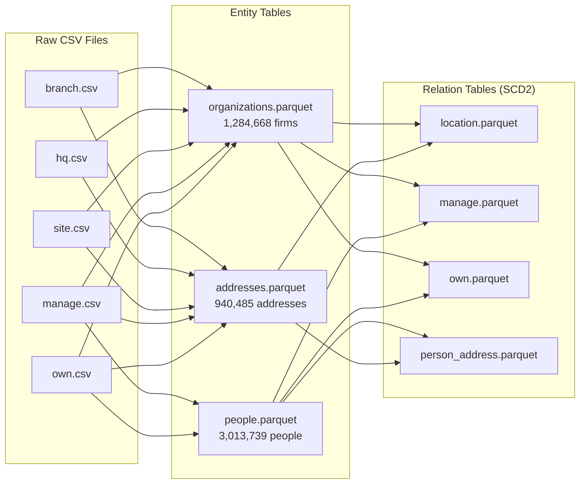
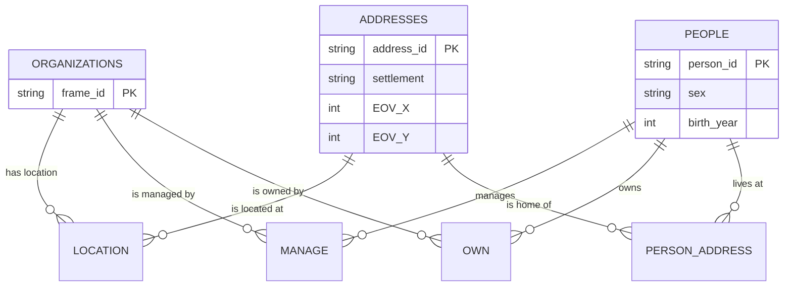

import { Code } from '@astrojs/starlight/components';

## The Basics

Entity Relational Modeling (ERD) is a way of organizing data into:

1. **Entities** - Things that exist (people, firms, addresses)
2. **Relations** - Connections between things (manages, owns, lives_at)

> "It's a 50-year-old concept. It's very well researched. I think everybody should have understood this already."

## Our Hackathon Example: Hungarian Company Registry

We have data about Hungarian companies with 1.3 million firms and 3 million people. The raw data comes in 5 CSV files:



## The Final ERD

Here's the entity-relationship diagram we built during the hackathon:



## Real Data Sample

Here's what actual people data looks like after extraction:

```
┌──────────────────┬─────────┬────────────┐
│    person_id     │   sex   │ birth_year │
├──────────────────┼─────────┼────────────┤
│ ft11220745       │ NULL    │       NULL │
│ PP148348_1270409 │ male    │       1986 │
│ PP146438_1269421 │ male    │       1974 │
│ PP139250_139251  │ male    │       1974 │
│ PP136480_1265814 │ female  │       1975 │
│ PP14780          │ male    │       1973 │
│ PP84682_2200     │ female  │       NULL │
│ PHM529_3044      │ female  │       NULL │
└──────────────────┴─────────┴────────────┘
```

Notice the ID prefixes:
- `ft` - firms (yes, firms can be managers/owners!)
- `PP` - natural persons from company registry
- `PHM` - natural persons from other sources
- `FP`, `PR` - other person types

## Why This Matters

Without ERD, you end up with the "single table trap." During the hackathon, we discussed a painful example:

> "Every single week, half of the meeting was about... this is supposed to be bid level, not tender level. It's tender part level. Is this bidder level? No, it's bid level."

With proper ERD:
- **Entity tables** have one row per entity (one person = one row)
- **Relation tables** connect entities with timestamps
- No confusion about unit of observation

## The Numbers

| Entity Table | Rows | Primary Key |
|-------------|------|-------------|
| organizations | 1,284,668 | frame_id |
| people | 3,013,739 | person_id |
| addresses | 940,485 | address_id |

| Relation Table | Connects |
|---------------|----------|
| location | org → address (HQ, branch, site) |
| manage | org → person (managers) |
| own | org → person (owners with shares) |
| person_address | person → address (home addresses) |
