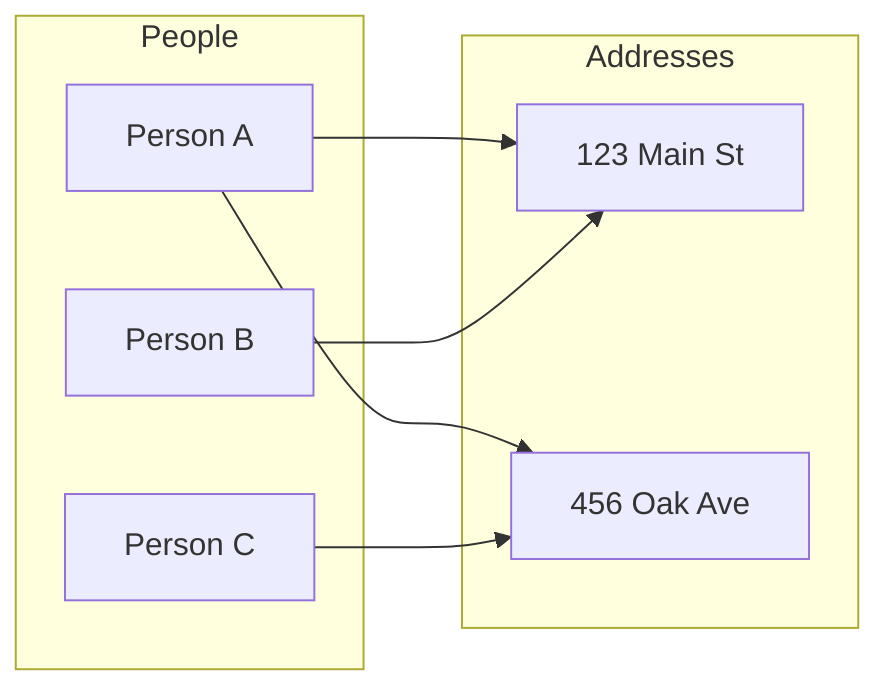
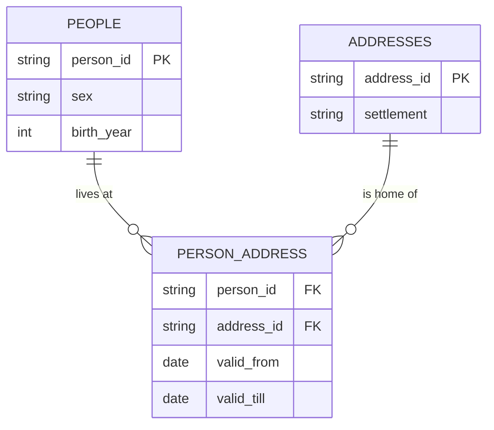
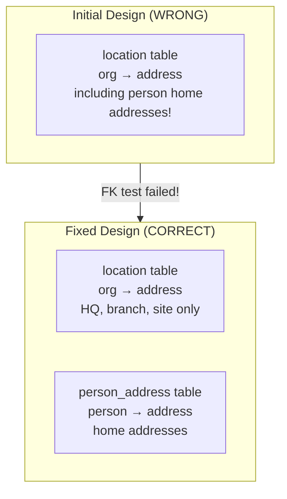

## The Many-to-Many Problem

Consider people living at addresses from our hackathon data:

> "The same person can live at different addresses. And at the same address, different people can live."

This is a **many-to-many** relationship. You cannot represent it by adding columns.



Person A lives at two addresses. Address 123 Main St has two residents. How do you store this in a single table?

## Why Single Tables Fail

**Attempt 1: Add address columns to people**
```
person_id | name | address_1 | address_2 | address_3 | ...
```
How many columns? What if someone has 10 addresses over time?

**Attempt 2: Add person columns to addresses**
```
address_id | street | person_1 | person_2 | person_3 | ...
```
Same problem in reverse.

**Attempt 3: One row per combination**
```
person_id | address_id | name | street
A         | 1          | Alice| Main St
A         | 2          | Alice| Oak Ave
B         | 1          | Bob  | Main St
```
Now "Alice" appears twice. Is birth_year the same in both rows? What if one says 1985 and one says NULL?

## The Solution: Junction Tables

Create a third table that connects the two entities:



## The Actual Code

Here's the SQL we wrote during the hackathon to create the `person_address` junction table:

```sql
-- code/create/person_address.sql
CREATE TABLE person_address AS
SELECT
    manager_id AS person_id,
    address_id,
    valid_from,
    valid_till,
    'manager' AS relation_type
FROM read_csv_auto('input/motherlode-opten_20250104/manage.csv')
WHERE manager_id IS NOT NULL AND address_id IS NOT NULL
UNION ALL
SELECT
    owner_id AS person_id,
    address_id,
    valid_from,
    valid_till,
    'owner' AS relation_type
FROM read_csv_auto('input/motherlode-opten_20250104/own.csv')
WHERE owner_id IS NOT NULL AND address_id IS NOT NULL;

COPY person_address TO 'temp/scd/person_address.parquet' (FORMAT PARQUET);
```

Notice:
- We extract `address_id` from **both** `manage.csv` and `own.csv`
- These are person home addresses (not company addresses!)
- We track `relation_type` to know the source

## When You Can Embed (One-to-One)

Some relationships are genuinely one-to-one:

> "Everybody has one mother. At least in Hungary. And so then you could directly write it in the entity table."

In our data, we embed `sex` and `birth_year` directly in the `people` table because each person has (at most) one sex and one birth year.

```sql
-- code/create/people.sql
CREATE TABLE people AS
SELECT
    person_id,
    MODE(sex) AS sex,           -- embedded attribute
    MODE(birth_year) AS birth_year  -- embedded attribute
FROM (...)
GROUP BY person_id;
```

## The Bug We Found

We initially put person addresses in the wrong table! The `address_id` in `manage.csv` and `own.csv` looked like it belonged with organization locations.



The FK integrity test caught this:
```
person_address.address_id -> addresses: FAIL
```

We had to update `addresses.sql` to include addresses from `manage.csv` and `own.csv`.

## The Rule

**If there's any chance the relationship could be many-to-many, make it a separate table from the start.**

In our hackathon:
- `location`: org ↔ address (many-to-many over time)
- `manage`: org ↔ person (many-to-many)
- `own`: org ↔ person (many-to-many with share %)
- `person_address`: person ↔ address (many-to-many over time)

All four needed separate junction tables.
