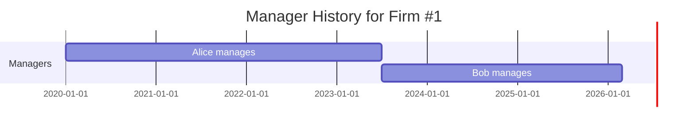
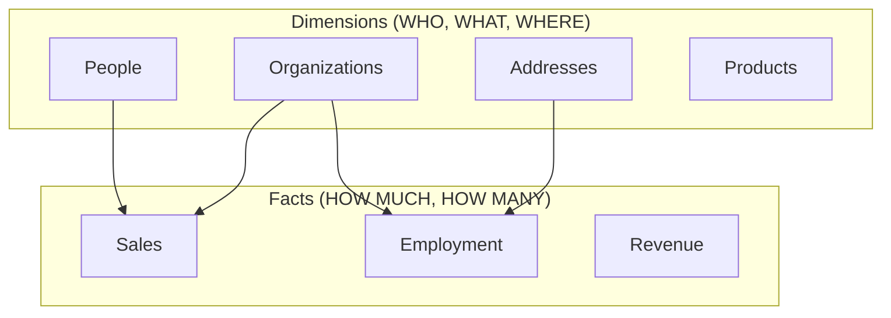

## The Problem: Things Change

Managers leave. Owners sell their shares. Companies move offices.

If you just update records, you lose history:

```sql
-- This destroys history!
UPDATE manage SET person_id = 'Bob' WHERE frame_id = '1';
```

Who was the manager before Bob? When did they leave? We don't know.

## SCD Type 2: Track History with Valid Dates

Add `valid_from` and `valid_till` columns:



In SQL:

| frame_id | person_id | valid_from | valid_till |
|----------|-----------|------------|------------|
| 1 | Alice | 2020-01-01 | 2023-06-30 |
| 1 | Bob | 2023-07-01 | NULL |

`NULL` in `valid_till` means "still active."

## The Actual Code

Here's our `location.sql` from the hackathon:

```sql
-- code/create/location.sql
CREATE TABLE location AS
SELECT frame_id, address_id, valid_from, valid_till, 'branch' AS loc_type
FROM read_csv_auto('input/motherlode-opten_20250104/branch.csv')
WHERE address_id IS NOT NULL
UNION ALL
SELECT frame_id, address_id, valid_from, valid_till, 'hq' AS loc_type
FROM read_csv_auto('input/motherlode-opten_20250104/hq.csv')
WHERE address_id IS NOT NULL
UNION ALL
SELECT frame_id, address_id, valid_from, valid_till, 'site' AS loc_type
FROM read_csv_auto('input/motherlode-opten_20250104/site.csv')
WHERE address_id IS NOT NULL;

COPY location TO 'temp/scd/location.parquet' (FORMAT PARQUET);
```

Notice:
- We preserve `valid_from` and `valid_till` from the source
- We add `loc_type` to distinguish HQ, branch, and site
- Each row represents one location during one time period

## Querying SCD2 Tables

**Current state only:**
```sql
SELECT * FROM location
WHERE valid_till IS NULL;
```

**Point-in-time query (what was the HQ on 2022-06-15?):**
```sql
SELECT * FROM location
WHERE loc_type = 'hq'
  AND valid_from <= '2022-06-15'
  AND (valid_till IS NULL OR valid_till > '2022-06-15');
```

**How many times has this firm moved its HQ?**
```sql
SELECT frame_id, COUNT(*) as moves
FROM location
WHERE loc_type = 'hq'
GROUP BY frame_id
HAVING COUNT(*) > 1;
```

## Why "Slowly Changing Dimensions"?

The term comes from data warehousing (Kimball methodology):

> "I want to explain dimensions versus facts. So do a bit of Kimball. Star schema."



**Dimensions** describe your data (who, what, where). They change slowly - a person's name rarely changes.

**Facts** are measurements (how much, how many). They change with every transaction.

## AI Understands SCD

Here's the magical part. During the hackathon, we tested this:

> "As soon as Haiku saw that the folder name was scd, it immediately realized that it's slowly changing dimension."

We removed all instructions, used a basic model (Haiku), and just ran `tree`:

```
temp/
├── entities/
│   ├── organizations.parquet
│   ├── people.parquet
│   └── addresses.parquet
└── scd/
    ├── location.parquet
    ├── manage.parquet
    ├── own.parquet
    └── person_address.parquet
```

The AI correctly identified: "SCD2 relations tracking historical data with valid_from/valid_till."

**Lesson**: Use standard naming conventions. The AI knows them.

## Our Folder Structure

```
code/create/
├── organizations.sql    → temp/entities/organizations.parquet
├── people.sql          → temp/entities/people.parquet
├── addresses.sql       → temp/entities/addresses.parquet
├── location.sql        → temp/scd/location.parquet
├── manage.sql          → temp/scd/manage.parquet
├── own.sql             → temp/scd/own.parquet
└── person_address.sql  → temp/scd/person_address.parquet
```

- `temp/entities/` = current-state entity tables
- `temp/scd/` = historical relation tables with SCD2
