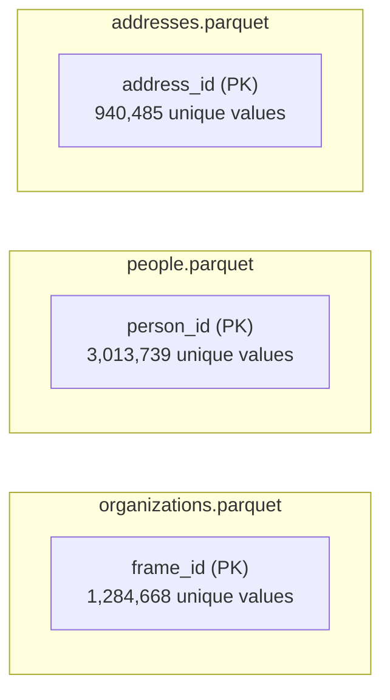
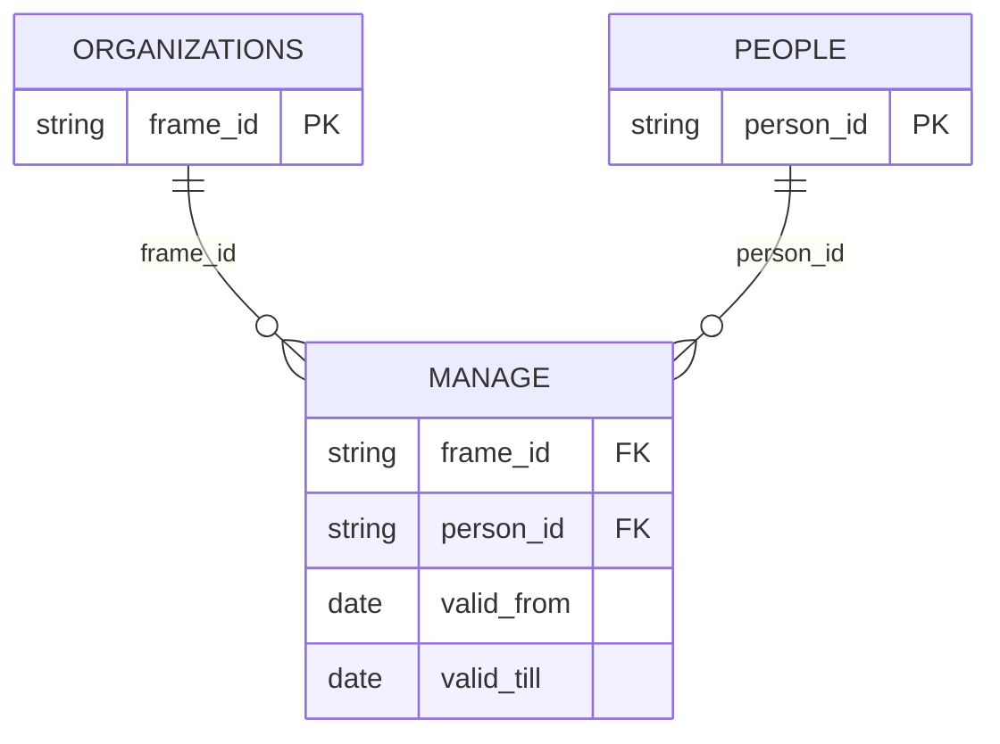
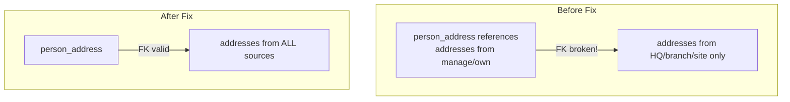

## Primary Keys: Identity

Every entity table needs a **primary key** - a column that uniquely identifies each row.



## The Duplicate Disaster

During the hackathon, we ran this test:

```sql
-- code/test/pk_uniqueness.sql
SELECT 'people: person_id unique' AS test,
    CASE WHEN (SELECT COUNT(*) FROM 'temp/entities/people.parquet') =
              (SELECT COUNT(DISTINCT person_id) FROM 'temp/entities/people.parquet')
         THEN 'PASS' ELSE 'FAIL' END AS result;
```

Result:

```
┌───────────────┬─────────┬───────────┐
│      tbl      │  total  │ unique_pk │
├───────────────┼─────────┼───────────┤
│ organizations │ 1284668 │   1284668 │
│ people        │ 3894436 │   3013739 │  ← PROBLEM!
│ addresses     │  940485 │    940485 │
└───────────────┴─────────┴───────────┘
```

**3.9 million rows but only 3 million unique person_ids!** That's 880,000 duplicates.

## Why Duplicates Occurred

The same person appeared in both `manage.csv` and `own.csv` with different attribute values:

```
person_id      | sex    | birth_year | source
PP148348       | male   | 1986       | manage.csv
PP148348       | male   | NULL       | own.csv
PP148348       | NULL   | 1986       | manage.csv (different row)
```

Our first query used `SELECT DISTINCT person_id, sex, birth_year` - which treats `(male, 1986)` and `(male, NULL)` as different!

## The Fix: MODE() Aggregation

```sql
-- code/create/people.sql (FIXED)
CREATE TABLE people AS
SELECT
    person_id,
    MODE(sex) AS sex,
    MODE(birth_year) AS birth_year
FROM (
    SELECT manager_id AS person_id, sex, birth_year
    FROM read_csv_auto('input/motherlode-opten_20250104/manage.csv')
    WHERE manager_id IS NOT NULL
    UNION ALL
    SELECT owner_id AS person_id, sex, birth_year
    FROM read_csv_auto('input/motherlode-opten_20250104/own.csv')
    WHERE owner_id IS NOT NULL
)
GROUP BY person_id;
```

`MODE()` picks the most frequent value per group. For `(male, male, NULL)`, it picks `male`.

After the fix: 3,013,739 rows = 3,013,739 unique PKs. **PASS**.

## Foreign Keys: References

Relation tables reference entity tables via foreign keys:



Every `frame_id` in `manage` must exist in `organizations`.
Every `person_id` in `manage` must exist in `people`.

## FK Integrity Tests

We wrote tests to verify this:

```sql
-- code/test/fk_integrity.sql
SELECT 'manage.frame_id -> organizations' AS test,
    CASE WHEN (SELECT COUNT(DISTINCT frame_id)
               FROM 'temp/scd/manage.parquet'
               WHERE frame_id NOT IN (SELECT frame_id FROM 'temp/entities/organizations.parquet')
              ) = 0
         THEN 'PASS' ELSE 'FAIL' END AS result;
```

Run all tests with:
```bash
make test
```

Output:
```
=== FK Integrity Tests ===
┌────────────────────────────────────┬─────────┐
│                test                │ result  │
├────────────────────────────────────┼─────────┤
│ location.frame_id -> organizations │ PASS    │
│ location.address_id -> addresses   │ PASS    │
│ manage.frame_id -> organizations   │ PASS    │
│ manage.person_id -> people         │ PASS    │
│ own.frame_id -> organizations      │ PASS    │
│ own.person_id -> people            │ PASS    │
│ person_address.person_id -> people │ PASS    │
│ person_address.address_id -> addresses │ PASS │
└────────────────────────────────────┴─────────┘
```

## The FK Bug We Caught

Initially, this test **failed**:

```
person_address.address_id -> addresses: FAIL
```

Why? The `addresses` table only included addresses from `branch.csv`, `hq.csv`, `site.csv` (organization addresses). But `person_address` had home addresses from `manage.csv` and `own.csv`!



Fix: Update `addresses.sql` to include addresses from all sources.

## Meaningful vs Meaningless IDs

We debated this during the hackathon:

> "Software engineers insist that IDs should be meaningless, either UUID or a counter. Because whenever you hang on to something meaningful, it's gonna change and you're gonna get screwed."

Our `person_id` values have meaning:
- `PP148348_1270409` - natural person
- `ft11220745` - firm (firms can own firms!)
- `PHM529_3044` - person from another source

This is convenient but risky. If the source system changes ID formats, we break.

**Our compromise**: Use source IDs for now, plan for concordance tables later.
