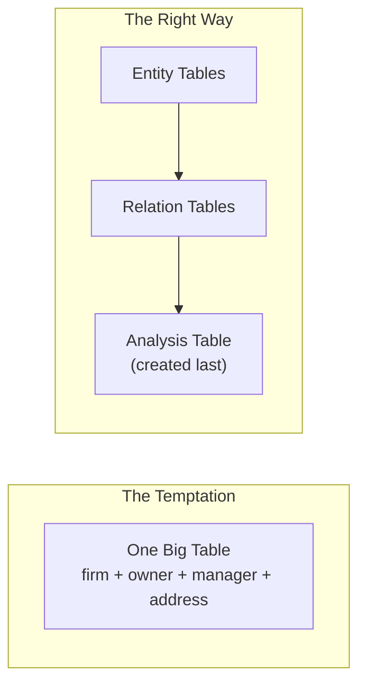
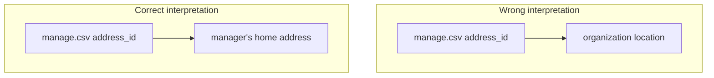
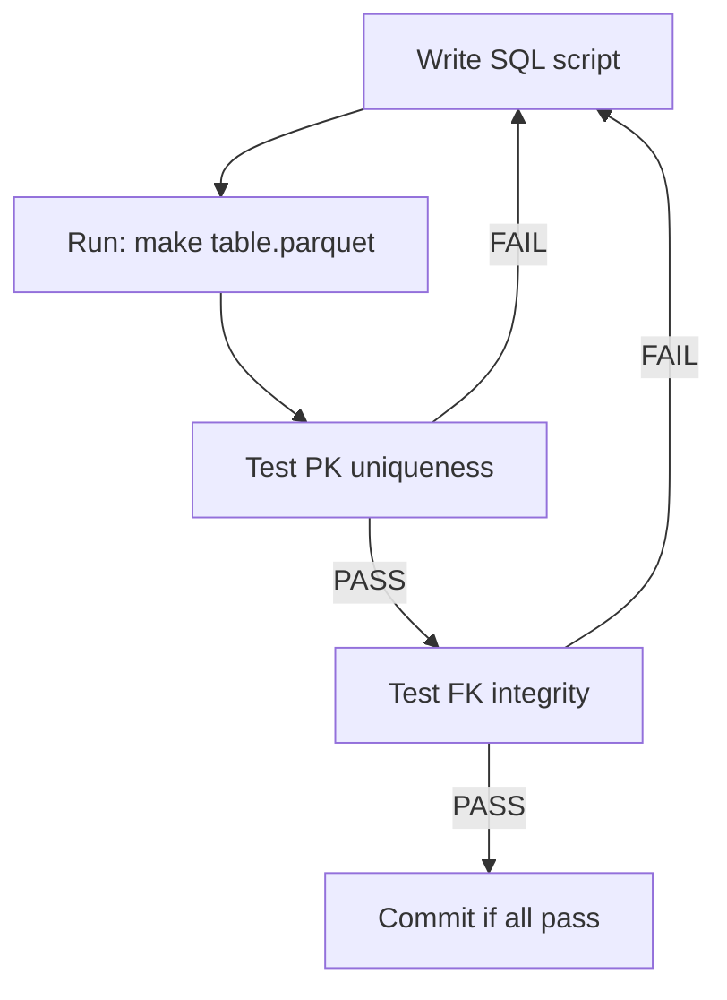

## Mistake 1: The Single Table Too Early



> "If you don't do this, you create a single table too early, then you will keep chasing yourself around in recovery."

In our hackathon data:
- If we merged firms + owners immediately, we'd have 1.3M × multiple owners = explosion
- Then adding managers = more explosion
- Then adding historical data = complete mess

**Rule**: Keep entity and relation tables separate. Merge only for a specific analysis.

## Mistake 2: Confusing Entity vs Relation Attributes

We made this mistake! Look at `manage.csv`:

| Column | Is it... |
|--------|----------|
| frame_id | FK to organization |
| manager_id | FK to person |
| valid_from | Relation attribute |
| sex | Person attribute? Or relation attribute? |
| birth_year | Person attribute? Or relation attribute? |
| address_id | ??? |

We initially thought `address_id` was the organization's address. Wrong! It's the **manager's home address**.



The FK test caught this:
```
person_address.address_id -> addresses: FAIL
```

## Mistake 3: Not Testing PK Uniqueness Immediately

Our first `people.sql`:

```sql
-- WRONG: Produces duplicates!
CREATE TABLE people AS
SELECT DISTINCT person_id, sex, birth_year FROM (...);
```

We didn't test until later. When we did:

```
people: 3,894,436 total, 3,013,739 unique → 880,697 DUPLICATES!
```

**Rule**: Test PK uniqueness immediately after creating any entity table.

```sql
-- Add this to your workflow:
SELECT COUNT(*) = COUNT(DISTINCT person_id) AS pk_unique
FROM people;
```

## Mistake 4: Trusting NULL Handling

SQL's NULL handling is tricky:

```sql
-- These are considered DIFFERENT by DISTINCT:
('male', 1986)
('male', NULL)
(NULL, 1986)
```

Our fix used `MODE()`:

```sql
SELECT
    person_id,
    MODE(sex) AS sex,           -- picks most frequent, prefers non-NULL
    MODE(birth_year) AS birth_year
FROM (...)
GROUP BY person_id;
```

## Mistake 5: Schemas in Documentation

We wrote column types in the README:

```markdown
| EOV_X | double |
| EOV_Y | double |
```

Then changed the code to use integers (EOV is in meters, no decimals needed).

> "The schema is gonna be in the header of the parquet anyway... if they become out of sync, then your agent's gonna get confused."

**Rule**: Don't duplicate schema in documentation. Let the data be self-documenting.

## Mistake 6: Not Using Standard Names

Good names that AI understands:

| Convention | Meaning |
|------------|---------|
| `temp/scd/` | Slowly Changing Dimensions |
| `valid_from`, `valid_till` | SCD2 time bounds |
| `*_id` suffix | Primary/foreign key |
| `code/create/` | Scripts that create tables |
| `code/test/` | Test scripts |

During the hackathon:
> "As soon as Haiku saw that the folder name was scd, it immediately realized that it's slowly changing dimension."

Use standard conventions. The AI knows them.

## The Test-Driven Data Pipeline

Our final workflow:



```bash
# Our actual commands:
make temp/entities/people.parquet
make test  # runs pk_uniqueness.sql and fk_integrity.sql
git add -A && git commit -m "Add people entity table"
```
