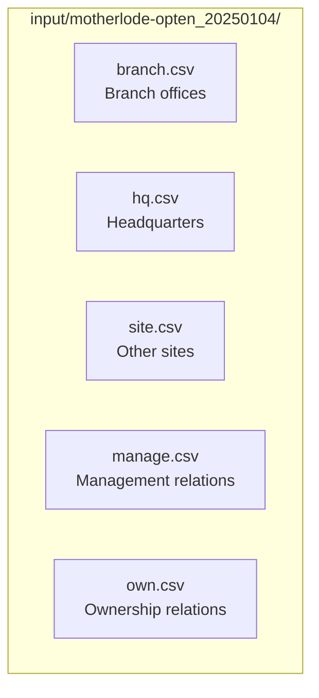
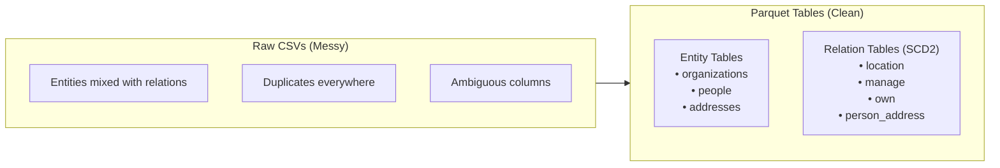
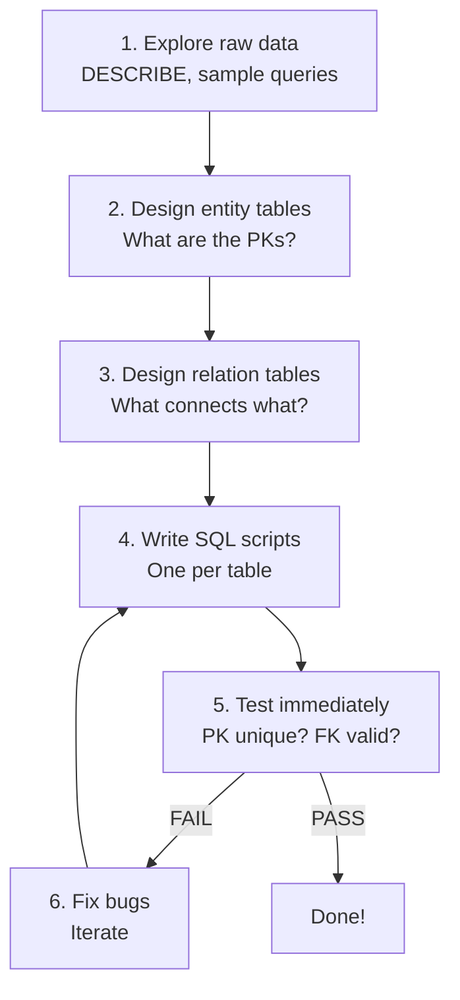

## The Raw Data

We have Hungarian company registry data from Opten, loaded via `bead`:

```bash
bead input load motherlode-opten_20250104
```

This gives us 5 CSV files:



## What's In Each File?

**Location files** (branch, hq, site):
```
frame_id | address_id | valid_from | valid_till | settlement | WGS84_lon | WGS84_lat | EOV_X | EOV_Y
```

**Relation files** (manage, own):
```
frame_id | manager_id/owner_id | valid_from | valid_till | sex | birth_year | address_id | ...
```

Notice the problem? The same `address_id` column means different things:
- In location files → organization's address
- In relation files → person's home address

We didn't realize this until tests failed!

## The Scale

| Source | Approximate Rows |
|--------|-----------------|
| branch.csv | ~500K |
| hq.csv | ~1.3M |
| site.csv | ~200K |
| manage.csv | ~3M |
| own.csv | ~4M |

Total: millions of rows, but manageable on a laptop with DuckDB.

## What We Need

Transform this mess into a clean relational model:



## The Tools

**DuckDB**: Analytical SQL database, perfect for this scale
```bash
duckdb -c "SELECT COUNT(*) FROM read_csv_auto('input/.../manage.csv')"
```

**Parquet**: Columnar storage format, self-describing schema
```bash
# No schema definition needed - DuckDB infers it
COPY table TO 'output.parquet' (FORMAT PARQUET);
```

**Makefile**: Orchestrates the pipeline
```makefile
temp/entities/people.parquet: code/create/people.sql $(PEOPLE_CSV)
    mkdir -p $(dir $@)
    $(DUCKDB) < $<
```

## Our Actual Makefile

Here's the real Makefile from the hackathon:

```makefile
DUCKDB := duckdb

INPUT := input/motherlode-opten_20250104
TEMP_ENTITIES := temp/entities
TEMP_SCD := temp/scd

ORG_CSV := $(INPUT)/branch.csv $(INPUT)/hq.csv $(INPUT)/site.csv \
           $(INPUT)/manage.csv $(INPUT)/own.csv
PEOPLE_CSV := $(INPUT)/manage.csv $(INPUT)/own.csv
ADDR_CSV := $(INPUT)/branch.csv $(INPUT)/hq.csv $(INPUT)/site.csv \
            $(INPUT)/manage.csv $(INPUT)/own.csv

ENTITIES := $(TEMP_ENTITIES)/organizations.parquet \
            $(TEMP_ENTITIES)/people.parquet \
            $(TEMP_ENTITIES)/addresses.parquet
SCD := $(TEMP_SCD)/location.parquet $(TEMP_SCD)/manage.parquet \
       $(TEMP_SCD)/own.parquet $(TEMP_SCD)/person_address.parquet

all: $(ENTITIES) $(SCD)

test: $(ALL)
    @echo "=== PK Uniqueness ===" && $(DUCKDB) < code/test/pk_uniqueness.sql
    @echo "=== FK Integrity ===" && $(DUCKDB) < code/test/fk_integrity.sql
```

Notice:
- Variables at the top for easy configuration
- Dependencies are explicit (which CSVs each table needs)
- `make test` runs after `make all`

## The Approach


