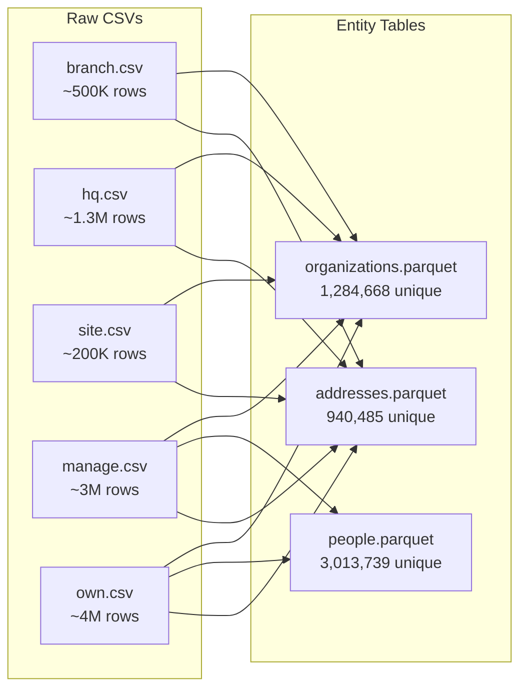
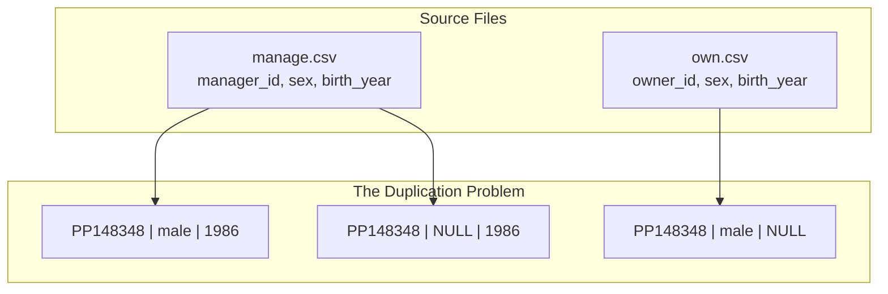
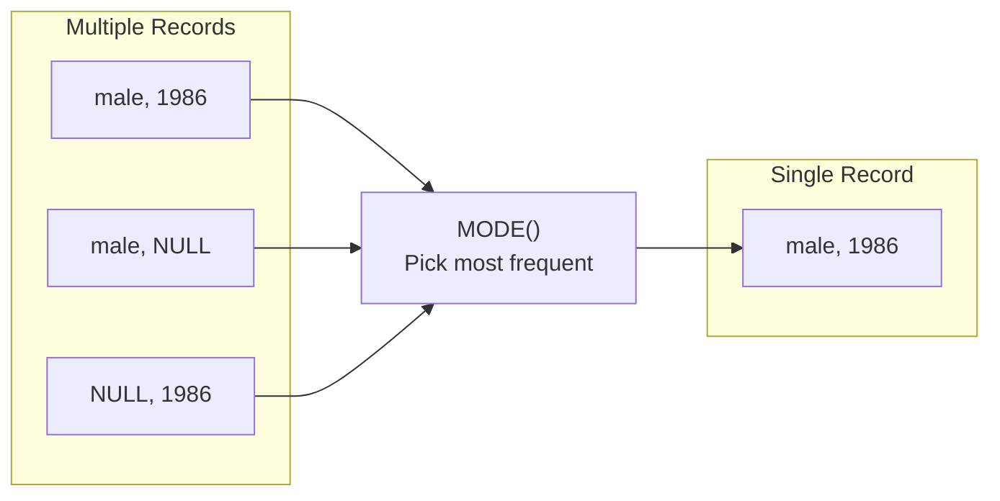

## The Goal

Extract unique entities from messy source files:



## Organizations

The simplest entity - just extract unique `frame_id` values:

```sql
-- code/create/organizations.sql
CREATE TABLE organizations AS
SELECT DISTINCT frame_id
FROM (
    SELECT frame_id FROM read_csv_auto('input/motherlode-opten_20250104/branch.csv')
    UNION ALL
    SELECT frame_id FROM read_csv_auto('input/motherlode-opten_20250104/hq.csv')
    UNION ALL
    SELECT frame_id FROM read_csv_auto('input/motherlode-opten_20250104/site.csv')
    UNION ALL
    SELECT frame_id FROM read_csv_auto('input/motherlode-opten_20250104/manage.csv')
    UNION ALL
    SELECT frame_id FROM read_csv_auto('input/motherlode-opten_20250104/own.csv')
);

COPY organizations TO 'temp/entities/organizations.parquet' (FORMAT PARQUET);
```

Result: 1,284,668 unique organizations.

## People

People are more complex - they appear in `manage.csv` and `own.csv` with attributes:



```sql
-- First attempt (WRONG)
CREATE TABLE people AS
SELECT DISTINCT person_id, sex, birth_year FROM (
    SELECT manager_id AS person_id, sex, birth_year FROM read_csv_auto('input/motherlode-opten_20250104/manage.csv')
    UNION ALL
    SELECT owner_id AS person_id, sex, birth_year FROM read_csv_auto('input/motherlode-opten_20250104/own.csv')
);
```

**Problem**: 3,894,436 rows but only 3,013,739 unique person_ids!

The same person has different `sex` or `birth_year` values across records (mostly NULL vs non-NULL). SQL's `DISTINCT` treats `(male, 1986)` and `(male, NULL)` as different tuples.

### The Fix: MODE() Aggregation



```sql
-- code/create/people.sql (CORRECT)
CREATE TABLE people AS
SELECT
    person_id,
    MODE(sex) AS sex,
    MODE(birth_year) AS birth_year
FROM (
    SELECT manager_id AS person_id, sex, birth_year
    FROM read_csv_auto('input/motherlode-opten_20250104/manage.csv')
    WHERE manager_id IS NOT NULL
    UNION ALL
    SELECT owner_id AS person_id, sex, birth_year
    FROM read_csv_auto('input/motherlode-opten_20250104/own.csv')
    WHERE owner_id IS NOT NULL
)
GROUP BY person_id;

COPY people TO 'temp/entities/people.parquet' (FORMAT PARQUET);
```

`MODE()` picks the most frequent value, preferring non-NULL over NULL.

Result: 3,013,739 unique people. All PKs unique.

## Addresses

Initial design only included organization addresses:

```sql
-- First attempt (INCOMPLETE)
CREATE TABLE addresses AS
SELECT DISTINCT address_id, settlement, WGS84_lon, WGS84_lat, EOV_X, EOV_Y
FROM (
    SELECT ... FROM read_csv_auto('input/motherlode-opten_20250104/branch.csv')
    UNION ALL
    SELECT ... FROM read_csv_auto('input/motherlode-opten_20250104/hq.csv')
    UNION ALL
    SELECT ... FROM read_csv_auto('input/motherlode-opten_20250104/site.csv')
);
```

**Problem discovered later**: `manage.csv` and `own.csv` contain person home addresses. FK integrity test failed!

### The Fix: Include All Address Sources

```sql
-- code/create/addresses.sql (CORRECT)
CREATE TABLE addresses AS
SELECT DISTINCT address_id, settlement, WGS84_lon, WGS84_lat, EOV_X, EOV_Y
FROM (
    -- Organization addresses (with geo data)
    SELECT address_id, settlement, WGS84_lon, WGS84_lat, EOV_X, EOV_Y
    FROM read_csv_auto('input/motherlode-opten_20250104/branch.csv') WHERE address_id IS NOT NULL
    UNION ALL
    SELECT address_id, settlement, WGS84_lon, WGS84_lat, EOV_X, EOV_Y
    FROM read_csv_auto('input/motherlode-opten_20250104/hq.csv') WHERE address_id IS NOT NULL
    UNION ALL
    SELECT address_id, settlement, WGS84_lon, WGS84_lat, EOV_X, EOV_Y
    FROM read_csv_auto('input/motherlode-opten_20250104/site.csv') WHERE address_id IS NOT NULL
    UNION ALL
    -- Person addresses (no geo data in source)
    SELECT address_id, NULL, NULL, NULL, NULL, NULL
    FROM read_csv_auto('input/motherlode-opten_20250104/manage.csv') WHERE address_id IS NOT NULL
    UNION ALL
    SELECT address_id, NULL, NULL, NULL, NULL, NULL
    FROM read_csv_auto('input/motherlode-opten_20250104/own.csv') WHERE address_id IS NOT NULL
);

COPY addresses TO 'temp/entities/addresses.parquet' (FORMAT PARQUET);
```

Person addresses have NULL geo data because the source doesn't provide it.

## The Lesson

Entity extraction seems simple but hides complexity:
- Duplicates from multiple sources
- Conflicting attribute values
- Missing entities that only appear in relations

Always test PK uniqueness immediately after creating an entity table.
