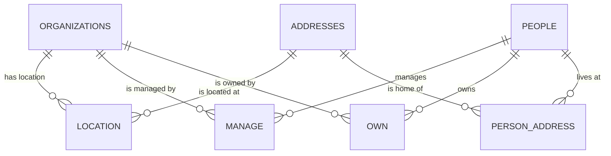

## Location: Organization → Address

Organizations have locations (HQ, branches, sites) that change over time:

```sql
-- code/create/location.sql
CREATE TABLE location AS
SELECT
    frame_id,
    address_id,
    valid_from,
    valid_till,
    loc_type
FROM (
    SELECT frame_id, address_id, valid_from, valid_till, 'hq' AS loc_type
    FROM read_csv_auto('input/hq.csv')
    WHERE frame_id IS NOT NULL AND address_id IS NOT NULL
    UNION ALL
    SELECT frame_id, address_id, valid_from, valid_till, 'branch' AS loc_type
    FROM read_csv_auto('input/branch.csv')
    WHERE frame_id IS NOT NULL AND address_id IS NOT NULL
    UNION ALL
    SELECT frame_id, address_id, valid_from, valid_till, 'site' AS loc_type
    FROM read_csv_auto('input/site.csv')
    WHERE frame_id IS NOT NULL AND address_id IS NOT NULL
);

COPY location TO 'temp/scd/location.parquet' (FORMAT PARQUET);
```

**Key point**: Only organization addresses go here (branch, hq, site).

## Manage: Organization → Person

Management relationships with full attributes:

```sql
-- code/create/manage.sql
CREATE TABLE manage AS
SELECT
    frame_id,
    manager_id AS person_id,
    valid_from,
    valid_till,
    manager_type,
    sex,
    birth_year,
    consistent,
    country_code,
    board,
    position,
    self_liquidator,
    liquidator
FROM read_csv_auto('input/manage.csv')
WHERE frame_id IS NOT NULL AND manager_id IS NOT NULL;

COPY manage TO 'temp/scd/manage.parquet' (FORMAT PARQUET);
```

Note: We keep `sex` and `birth_year` here even though they're also in `people`. This is intentional - they record the value at the time of the relationship, which might differ from the current entity value.

## Own: Organization → Person

Ownership with share information:

```sql
-- code/create/own.sql
CREATE TABLE own AS
SELECT
    frame_id,
    owner_id AS person_id,
    valid_from,
    valid_till,
    owner_type,
    sex,
    birth_year,
    consistent,
    country,
    share,
    share_flag,
    share_source
FROM read_csv_auto('input/own.csv')
WHERE frame_id IS NOT NULL AND owner_id IS NOT NULL;

COPY own TO 'temp/scd/own.parquet' (FORMAT PARQUET);
```

## Person Address: The Bug Fix

We initially forgot this relation entirely. The `address_id` in `manage.csv` and `own.csv` is the person's home address, not the organization's location.

**The bug**: FK integrity test failed:
```
person_address.address_id -> addresses: FAIL
```

**The fix**: Create a separate relation table:

```sql
-- code/create/person_address.sql
CREATE TABLE person_address AS
SELECT
    manager_id AS person_id,
    address_id,
    valid_from,
    valid_till,
    'manager' AS relation_type
FROM read_csv_auto('input/manage.csv')
WHERE manager_id IS NOT NULL AND address_id IS NOT NULL
UNION ALL
SELECT
    owner_id AS person_id,
    address_id,
    valid_from,
    valid_till,
    'owner' AS relation_type
FROM read_csv_auto('input/own.csv')
WHERE owner_id IS NOT NULL AND address_id IS NOT NULL;

COPY person_address TO 'temp/scd/person_address.parquet' (FORMAT PARQUET);
```

Also had to update `addresses.sql` to include these addresses (see previous section).

## The Final ERD



Four relation tables connecting three entity tables. All with SCD2 (valid_from, valid_till).
