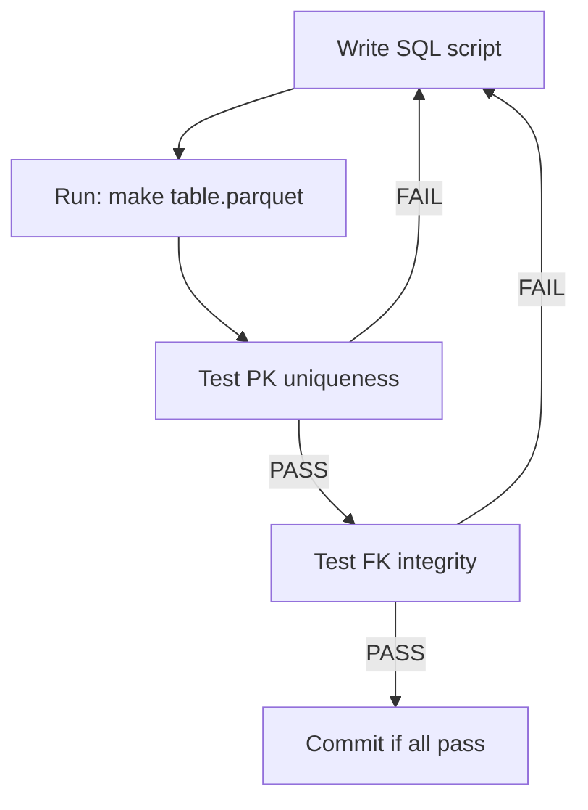

## Why Test?

> "This is good practice to save tests and run them from time to time."

Data pipelines break silently. Without tests, you won't know until your analysis produces nonsense.



## Test 1: Primary Key Uniqueness

Every entity table must have unique primary keys:

```sql
-- code/test/pk_uniqueness.sql
SELECT '=== PK Uniqueness Tests ===' AS test;

-- Organizations: frame_id should be unique
SELECT 'organizations: frame_id unique' AS test,
    CASE WHEN (SELECT COUNT(*) FROM 'temp/entities/organizations.parquet') =
              (SELECT COUNT(DISTINCT frame_id) FROM 'temp/entities/organizations.parquet')
         THEN 'PASS' ELSE 'FAIL' END AS result;

-- People: person_id should be unique
SELECT 'people: person_id unique' AS test,
    CASE WHEN (SELECT COUNT(*) FROM 'temp/entities/people.parquet') =
              (SELECT COUNT(DISTINCT person_id) FROM 'temp/entities/people.parquet')
         THEN 'PASS' ELSE 'FAIL' END AS result;

-- Addresses: address_id should be unique
SELECT 'addresses: address_id unique' AS test,
    CASE WHEN (SELECT COUNT(*) FROM 'temp/entities/addresses.parquet') =
              (SELECT COUNT(DISTINCT address_id) FROM 'temp/entities/addresses.parquet')
         THEN 'PASS' ELSE 'FAIL' END AS result;
```

Run with:
```bash
duckdb < code/test/pk_uniqueness.sql
```

Output:
```
┌────────────────────────────────┬─────────┐
│              test              │ result  │
├────────────────────────────────┼─────────┤
│ organizations: frame_id unique │ PASS    │
│ people: person_id unique       │ PASS    │
│ addresses: address_id unique   │ PASS    │
└────────────────────────────────┴─────────┘
```

## Test 2: Foreign Key Integrity

Every foreign key in a relation table must reference an existing primary key:

```sql
-- code/test/fk_integrity.sql
SELECT '=== FK Integrity Tests ===' AS test;

-- location: frame_id must exist in organizations
SELECT 'location.frame_id -> organizations' AS test,
    CASE WHEN (SELECT COUNT(DISTINCT frame_id) FROM 'temp/scd/location.parquet'
               WHERE frame_id NOT IN (SELECT frame_id FROM 'temp/entities/organizations.parquet')) = 0
         THEN 'PASS' ELSE 'FAIL' END AS result;

-- location: address_id must exist in addresses
SELECT 'location.address_id -> addresses' AS test,
    CASE WHEN (SELECT COUNT(DISTINCT address_id) FROM 'temp/scd/location.parquet'
               WHERE address_id NOT IN (SELECT address_id FROM 'temp/entities/addresses.parquet')) = 0
         THEN 'PASS' ELSE 'FAIL' END AS result;

-- ... similar tests for manage, own, person_address
```

## Makefile Integration

Add a `test` target:

```makefile
.PHONY: all test clean

all: $(ALL)

test: $(ALL)
    $(DUCKDB) < code/test/pk_uniqueness.sql
    $(DUCKDB) < code/test/fk_integrity.sql

clean:
    rm -rf temp/entities temp/scd
```

Now `make test` runs all tests after building.

## When Tests Fail

We had a failure:

```
person_address.address_id -> addresses: FAIL
```

This meant addresses in `manage.csv` and `own.csv` weren't in our `addresses` entity table.

**Debug process**:
1. Identify which addresses are missing
2. Trace back to source files
3. Realize these are person home addresses, not org addresses
4. Update `addresses.sql` to include them
5. Re-run tests: PASS

## Test Patterns

| Test | What It Catches |
|------|-----------------|
| PK unique | Duplicate entities from bad deduplication |
| FK integrity | Missing entities, wrong join columns |
| Row counts | Silent filtering, missing sources |
| NULL checks | Unexpected missing data |
| Date validity | `valid_from > valid_till` errors |

## Sample Data Verification

Beyond automated tests, always eyeball samples:

```sql
-- Quick sanity check
SELECT * FROM 'temp/entities/people.parquet' LIMIT 25;
```

Look for:
- Reasonable values
- Expected data types
- ID formats that make sense
- NULLs where expected (and not where unexpected)
