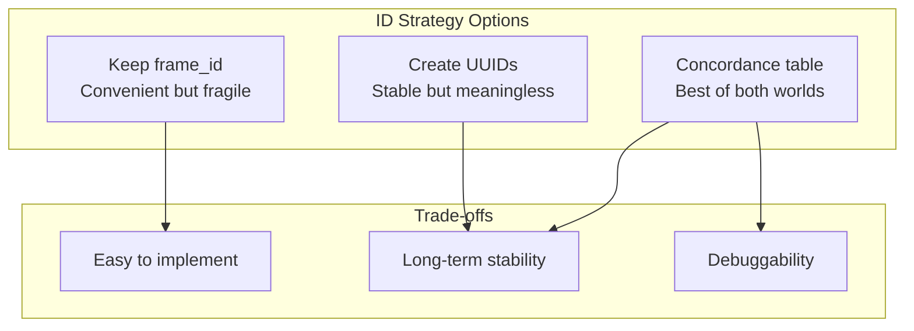
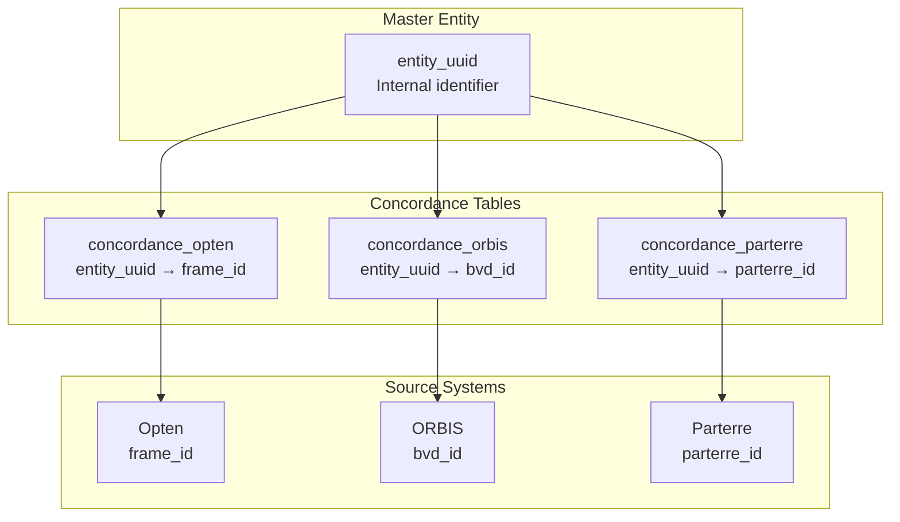

## Question 1: UUID vs Meaningful IDs

We use `frame_id` from the source system. It's convenient but has issues:

> "Frame IDs are changing version to version."

**Options**:
1. **Keep frame_id** - Convenient, but breaks when source changes
2. **Create UUIDs** - Stable, but loses meaning
3. **Concordance table** - Map our UUID to source IDs

We didn't resolve this. Current approach: keep frame_id, deal with changes when they happen.

## Question 2: Organization Types

Our `organizations` table includes:
- Firms (have frame_id)
- Possibly government agencies
- Possibly foreign entities
- "Unknown" entities mentioned in relations but not in entity sources

> "Corporations have a frame_id. Peers are organizations. Government agencies are organizations."

**Should we**:
- Keep them all in one table?
- Split by type?
- Use a `type` column?

We kept one table for now. The `frame_id` prefix (e.g., `ft` for firms) encodes some type information.

## Question 3: Foreign Entities

Some owners are foreign (e.g., German parent company):

> "Sometimes this is a German something. We have no idea what, but it's German."

These don't have Hungarian registry entries. How to handle?

**Current approach**: They get a person_id from the source, stored in `people` table with minimal attributes.

**Future option**: Separate `foreign_entities` table with country, name, and concordance to ORBIS/BvD IDs.

## Question 4: Version Stability

When we update the source data:

> "The previous entity tables preview the IDs. So it's another merge."

**Problem**: If person_id changes between versions, downstream analysis breaks.

**Possible solutions**:
1. **Never change IDs** - Match by attributes (name, birth_year)
2. **Version column** - `person_id_v1`, `person_id_v2`
3. **Concordance table** - Map old IDs to new IDs

None implemented yet. This is a known pain point in master data management.

## Question 5: Composite Foreign Keys

Currently, `owns` has separate columns:
- `frame_id` (FK to organizations)
- `person_id` (FK to people)

But owners can be organizations (firms owning firms):

> "Firms can also own firms."

**Options**:
1. **owner_type column** - "person" or "organization"
2. **Separate tables** - `person_owns`, `org_owns`
3. **Polymorphic FK** - `owner_id` + `owner_type`

We noted this but didn't implement. The source data (`own.csv`) has an `owner_type` field we could use.

## Question 6: Cross-Source Matching

We have multiple data sources (Opten, ORBIS, etc.):

> "We would map that same ID to an Opten ID if they have one. And to a Parterre ID if they have one."

**The vision**: Master entity table with UUIDs, concordance tables mapping to each source.

**Reality**: We only implemented one source (Opten) in this hackathon.

## The Meta-Question

> "These should be spelled out as clearly as possible."

Even unanswered questions have value. By documenting them:
1. Future maintainers understand the constraints
2. Design decisions become explicit
3. Known limitations are visible

This is why we record open questions, not just solutions.
